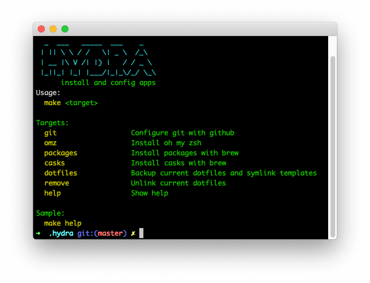

# Hydra

> Install and config apps on macOS



## Problem
-------

Its very time consuming to setup my development environment on a new macOS machine.

## Cause
-------

Need to setup git, the shell, install applications and then modify the dotfiles.

## Solution
-------

Developed hydra with makefile and shell scipts that can download, install applications and setup the development tools.

## Prerequisites
-------

- macOS
- ZSH

## Install
-------

Clone this repo somewhere. Here we'll use `$HOME/.hydra`.

```sh
mkdir -p "$HOME/.hydra"
git clone https://github.com/papasavvas/hydra.git "$HOME/.hydra"
```

## Getting Started
-------

- Change working directory to the cloned repository.
- Use make to execute tasks

```sh
cd "$HOME/.hydra"
make help
```

## Options
-------

| Command                           | Description                      |
| :------------------------------- | :---------------------------------|
| **`make help`**     | Show help.                                     |
| **`make git`**      | Configure git with github.                     |
| **`make packages`** | Install packages with brew.                    |
| **`make casks`**    | Install casks with brew.                       |
| **`make dotfiles`** | Backup current dotfiles and symlink templates. |
| **`make remove`**   | Unlink current dotfiles.                       |

## Configuration
-------

- Add to brew/casks one cask per line
- Add to brew/package one package per line
- Create inside templates/ the dotfiles you want to symlink into the home directory. Do not use dot as prefix.

## License
-------

hydra is copyright © 2020 Alexandros Papasavva. It is free software, and may be redistributed under the terms specified in the [`LICENSE`] file.

[`LICENSE`]: /LICENSE